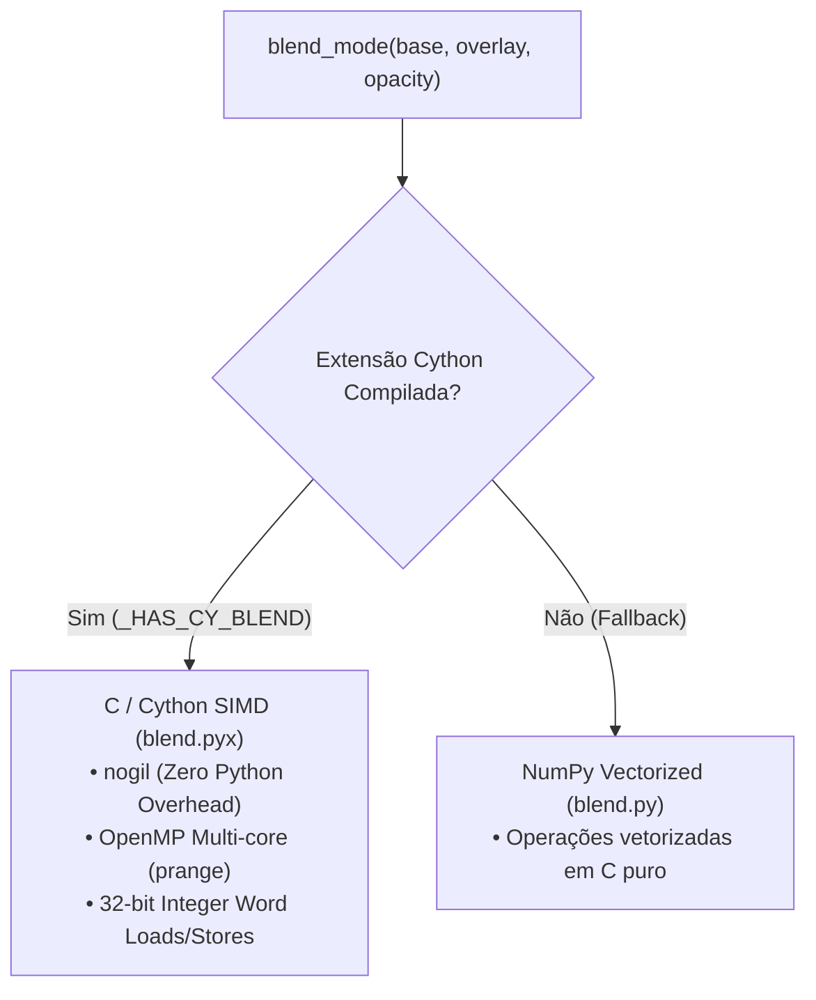

# Guia de Modos de Mesclagem (`blend.py` & `BlendMode`)

O subsistema de mesclagem (`anicrop.blend` e `anicrop.enums.BlendMode`) é o motor responsável pela composição matemática e fusão de pixels entre camadas (`Layer`, `GroupLayer`), patches de edição (`EditLayer`) e buffers de renderização (`CanvasRender`, `ViewportRender`).

---

## 1. Modos de Mesclagem Disponíveis (`BlendMode`)

O enum [`BlendMode`](file:///home/gui/python/anicrop/src/anicrop/enums.py) define as operações de mistura suportadas pelo motor:

| Modo de Mesclagem | Nome String | Prioridade | Comportamento Principal | Casos de Uso Recomendados |
| :--- | :--- | :--- | :--- | :--- |
| **`BlendMode.NORMAL`** | `"normal"` | Camada Superior | Composição padrão Porter-Duff ($A \text{ over } B$) com interpolação de canal alfa. | Camadas gerais, ilustrações, gráficos com transparência gradual. |
| **`BlendMode.NORMAL_LINEAR`** | `"normal_linear"` | Camada Superior | Composição Porter-Duff calculada no espaço linear de luminosidade (gama corrigido). | Composição de alta fidelidade física que evita escurecimento em bordas translúcidas. |
| **`BlendMode.MULTIPLY`** | `"multiply"` | Múltipla | Multiplica os valores normalizados de cor da base e do overlay ($C = C_{\text{base}} \times C_{\text{overlay}}$). | Sombras, texturização, sobreposição de rascunhos. |
| **`BlendMode.HARD_MASKING`** | `"hard_masking"` | **Top-First** *(Overlay)* | Substituição com limiar: onde o overlay possui $\alpha \ge \text{hard\_mask\_threshold}$ (padrão 128), ele **sobrescreve** a base e fixa $\alpha = 255$. Onde o overlay for transparente ou penumbra fraca ($\alpha < 128$), a base permanece **100% intacta**. | **Stitching de Panoramas com prioridade no topo**, adesivos (*stickers*), marcas d'água, recortes duros (*1-bit alpha*). |
| **`BlendMode.SOLID_FILL`** | `"solid_fill"` | **Base-First** *(Canvas)* | Preenchimento protegido: o canvas consolidado ($\alpha \ge 250$) é **intocável**; o overlay só preenche vazios onde $\alpha \ge \text{solid\_fill\_threshold}$ (padrão 200) e fixa $\alpha = 255$. | **Costura de Panoramas (*Stitching* / Mosaicos com prioridade na base)**, preenchimento de lacunas sem alterar o conteúdo consolidado. |
| **`BlendMode.CLIP`** | `"clip"` | Modulação | Modula o canal alfa da base onde houver transparência e preenche com branco sólido as áreas cortadas de camadas RGB. | Recorte de pixels não-destrutivo (`Content.crop`). |

---

## 2. Comparativo: `HARD_MASKING` vs `SOLID_FILL`

Ambos os modos operam com binarização rápida de pixels (sem o custo de blend alfa fracionário e imunes a franjas de penumbra), porém atendem a direções de prioridade **diferentes**:

```text
HARD_MASKING (Top-First com Proteção de Base):
   [ Novo Overlay (alpha >= hard_mask_threshold) ]  ---> Sobrescreve a base e fixa alpha=255
   [ Novo Overlay (alpha < hard_mask_threshold) ]   ---> Não toca na base! (Base 100% preservada)
   (Ideal quando o frame mais recente tem prioridade sobre o anterior no stitching)

SOLID_FILL (Base-First):
   [ Base Sólida (alpha >= 250) ]  <--- Intocável!
   [ Buracos Transparentes ]        <--- Preenchidos por [ Overlay (alpha >= solid_fill_threshold) ]
   (O que já foi desenhado na base é protegido; o novo frame só preenche lacunas)
```

### Configuração Centralizada de Limiares (`config`)
Tanto `HARD_MASKING` quanto `SOLID_FILL` obtêm seus limiares diretamente do singleton central [`config`](file:///home/gui/python/anicrop/src/anicrop/config.py), sem alterar a assinatura canônica de blend:

```python
from anicrop import config

# Ajustar limiares globalmente ou dentro de contextos temporários:
config.hard_mask_threshold = 128  # Padrão: 128 [0, 255]
config.solid_fill_threshold = 200  # Padrão: 200 [0, 255]

with config(hard_mask_threshold=160):
    # Renderização utilizando limiar mais restritivo para corte do overlay
    doc.render()
```

### Por que o `HARD_MASKING` e o `SOLID_FILL` eliminam 100% das franjas em panoramas?
Ao rotacionar frames com interpolação contínua (`LANCZOS`, `CUBIC`), as bordas extremas ganham pixels semitransparentes de *antialiasing* ($\alpha \approx 1 \dots 100$).
* No `HARD_MASKING`: a condição $\alpha \ge \text{hard\_mask\_threshold}$ descarta essa penumbra fraca, evitando que ruídos ou bordas transparentes apaguem o frame sólido que já existia na base. Onde o novo frame é sólido, ele substitui a base perfeitamente e fixa $\alpha = 255$.
* No `SOLID_FILL`: o canvas opaco consolidado é bloqueado contra alterações ($\alpha \ge 250$), a penumbra fraca ($\alpha < \text{solid\_fill\_threshold}$) é descartada e os novos pixels válidos recebem $\alpha = 255$ puro, gerando costuras contínuas.

### Tolerância Subpixel e Alinhamento Automático de Bordas
Em transformações contínuas e translações subpixel (ex: $x=10.4, y=20.6$), a projeção de regiões pode gerar variações dimensionais mínimas de $\pm 1\text{px}$ entre o fatiamento fonte e o destino no canvas (ex: $1921 \times 1082$ vs $1921 \times 1083$).
Tanto o kernel Cython nativo quanto as rotinas NumPy do `anicrop.blend` implementam alinhamento pela área de interseção comum (`min(w), min(h)`) com tolerância de até $2\text{px}$, garantindo que loops de renderização em lote rodem com estabilidade contínua sem abortar.


---

## 3. Arquitetura e Aceleração de Performance

O módulo `anicrop.blend` implementa arquitetura híbrida de execução:



### Características Técnicas do Kernel Cython:
1. **Zero GIL Overhead (`nogil`):** Toda a mesclagem é executada em código de máquina C nativo compilado com `-O3 -march=native -ffast-math`.
2. **Paralelismo Multi-Core (`OpenMP prange`):** O processamento de linhas da imagem é distribuído entre todos os núcleos da CPU.
3. **Carga e Descarga Vetorial de 32-bit:** Em modos de substituição como `SOLID_FILL` e `HARD_MASKING`, as operações em buffers RGBA lêem e gravam palavras de 32 bits (`uint32_t`) em uma única instrução Assembly (`MOV`), habilitando auto-vetorização AVX2/SSE4 pelo compilador.

---

## 4. Exemplos Práticos de Uso

### 4.1. Definindo o Modo de Mesclagem em uma Camada
```python
from anicrop import Document, Image, ImageFormat, Layer
from anicrop.enums import BlendMode

# Criar camada com modo SOLID_FILL para stitching
layer = Layer(
    Image.open("frame_02.png", format=ImageFormat.RGBA),
    blend_mode=BlendMode.SOLID_FILL,
    name="Frame02",
)

# Ou alterar diretamente na propriedade:
layer.blend_mode = BlendMode.MULTIPLY
```

### 4.2. Usando em Patches Não-Destrutivos (`add_edit`)
```python
# Adiciona um patch que substitui os pixels locais com corte duro (HARD_MASKING)
layer.add_edit(patch_img, patch_region, blend_mode=BlendMode.HARD_MASKING)
```

### 4.3. Usando na Composição e Flatten
```python
from anicrop.composition import flatten
from anicrop.enums import BlendMode, ImageFormat

# Flatten preserva automaticamente o blend_mode da base e o ImageFormat do topo
cena_plana = flatten([fundo, camada_detalhe], name="CenaConsolidada")
```
