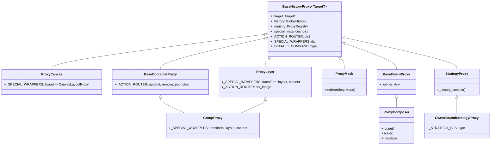

# Guia da Infraestrutura Reativa e Proxies (`anicrop.reactive` / `anicrop.proxy`)

O sub-pacote `anicrop.reactive` fornece a camada de interceptação reativa e gerenciamento de identidade para Undo/Redo no `anicrop`. Utilizando o padrão de projeto **Proxy Transparente** combinado com um **Identity Map** (`ProxyRegistry`), ele desacopla totalmente os objetos de domínio (`Canvas`, `Layer`, `GroupLayer`, `Mask`) do motor de histórico (`GlobalHistory`), permitindo alta flexibilidade, tipagem estrita e ausência de *overhead* em pipelines diretos de alta performance.

---

## 1. Visão Geral e Arquitetura Reativa

A separação entre domínio e histórico baseia-se em princípios fundamentais:

- **Domínio 100% Puro**: As entidades centrais (`Layer`, `GroupLayer`, `Canvas`, `Mask`) desconhecem pilhas de histórico, transações ou deltas. Elas operam puramente com matrizes 3x3, buffers de imagem e nós de árvore.
- **Identity Map (`ProxyRegistry`)**: Gerenciado via `weakref.WeakValueDictionary`. Garante que cada instância de domínio possua **exatamente um Proxy ativo**. Chamar `registry.get_or_create(layer)` repetidamente sempre retorna a mesma instância de proxy enquanto ela estiver em uso.
- **Imunidade contra "Proxy Duplo"**: Se um objeto passado já for uma instância de `BaseHistoryProxy`, o sistema detecta imediatamente (`hasattr(target, '_target')`) e retorna o próprio proxy sem re-empacotar.
- **Registro ABC Virtual**: Todos os proxies registram-se como subclasses virtuais de seus tipos correspondentes (ex: `Canvas.register(ProxyCanvas)`, `BaseLayer.register(ProxyLayer)`). Isso permite que `isinstance(proxy, Canvas)` e `isinstance(proxy, BaseLayer)` avaliem como `True` em toda a biblioteca e em código de clientes.

---

## 2. Tipos de Proxies Existentes e Suas Características

A infraestrutura do `anicrop.reactive` disponibiliza 8 tipos especializados de proxies:



---

### 2.1. `BaseHistoryProxy[TargetT]` (`anicrop.reactive.base`)
Proxy genérico e agnóstico de qualquer objeto Python.
- **Interceptação de Atributos**:
  - `__getattribute__`: resolve wrappers especialistas (`_SPECIAL_WRAPPERS`), constrói wrappers de métodos (`_ACTION_ROUTER`) ou envolve resultados no Identity Map (`wrap_domain_result`).
  - `__setattr__`: detecta propriedades com setter via `is_property_with_setter` e atributos escalares comuns via `resolve_setattr_command`, gravando automaticamente através de `_DEFAULT_COMMAND` (padrão: `AdaptiveCommand` com deltas $O(1)$).
  - Propriedades somente-leitura (`is_readonly_property`, como `canvas.width` ou `layer.size`) são ignoradas pelo histórico e disparam o `AttributeError` nativo do Python diretamente no objeto alvo.
- **Cache de Instâncias Especiais (`_special_instances`)**: Garante estabilidade de identidade para propriedades complexas (`proxy.layout is proxy.layout` e `proxy.content is proxy.content` avaliam como `True`).

---

### 2.2. `ProxyLayer` (`anicrop.reactive.layer`)
Proxy especialista para camadas folha (`Layer`).
- **Wrappers Especialistas**:
  - `"transform": ProxyComposer`
  - `"layout": LayerLayoutProxy`
  - `"content": LayerContentProxy`
- **Proteção Estrutural**: Bloqueia a atribuição direta a `layer.parent = ...`, exigindo que a hierarquia seja manipulada via contêineres (`container.append`, `container.remove`).
- **Ações Mapeadas**: Roteia substituições de imagem de base (`set_image`) para `LayerImageCommand`.

---

### 2.3. `GroupProxy` (`anicrop.reactive.layer`)
Proxy composto que herda simultaneamente de `BaseContainerProxy` e `ProxyLayer` para contêineres de grupo (`GroupLayer`).
- **Wrappers Especialistas**:
  - `"transform": ProxyComposer`
  - `"layout": GroupLayoutProxy`
  - `"content": GroupContentProxy`
- **Manipulação Hierárquica**: Intercepta métodos de contêiner (`append`, `remove`, `pop`, `insert`, `clear`) usando `ContainerCommand` e `ContainerSnapshot`, atualizando a árvore bidirecional e `_parent_inverse`.
- **Navegação Transparente**: A indexação (`group[0]`) e iteração (`for child in group:`) retornam instâncias de `ProxyLayer` ou `GroupProxy` automaticamente.

---

### 2.4. `ProxyCanvas` (`anicrop.reactive.canvas`)
Proxy especialista para a moldura de cena (`Canvas`).
- **Rastreamento de Escalares**: Mutações em `canvas.bg_color` e `canvas.region` são registradas via `AdaptiveCommand` em $O(1)$.
- **Wrapper Especialista**:
  - `"layout": CanvasLayoutProxy`
- **Operações Espaciais no Canvas**: Chamadas diretas como `canvas.layout.resize_bounds(1920, 1080)` ou indiretas via fachada `doc.layout.resize_bounds(doc.canvas, 1920, 1080)` operam dentro de transações atômicas com Undo e Redo de 1 único passo.

---

### 2.5. `ProxyMask` (`anicrop.reactive.mask`)
Proxy especialista para a máscara da camada (`Mask`).
- **Micro-Snapshots de Pixels por Slice**: Intercepta escritas atômicas indexadas na máscara (`mask[y1:y2, x1:x2] = 0`), gravando apenas o recorte de pixels modificado via `MaskCommand` com `MaskImageSnapshot`.
- **Parâmetros de Estado**: Mutações em `mask.visible` e `mask.invert` são capturadas através de `MaskStateSnapshot`.

---

### 2.6. `LayerStackProxy` e `BaseContainerProxy` (`anicrop.reactive.container`)
Gerenciam a pilha principal de camadas (`LayerStack`) e contêineres compostos (`Container`).
- Rastreiam mutações estruturais (`append`, `remove`, `pop`, `clear`) via `ContainerCommand`.
- Asseguram que `layer.parent` seja sempre um proxy reativo do contêiner correspondente.

---

### 2.7. `ProxyComposer` (`BaseFluentProxy`) (`anicrop.reactive.fluent`)
Proxy fluente para composição de transformações matriciais 3x3 na propriedade `.transform`.
- **Encadeamento Fluente**: Suporta chamadas consecutivas como `layer.transform.rotate(45).scale(2.0, 2.0).translate(10, 20)`.
- **Selagem Automática no Garbage Collection (`__del__`)**: Ao contrário de outros wrappers que são cacheados, instâncias de `ProxyComposer` são criadas na leitura de `.transform` e seladas automaticamente no encerramento da expressão, gerando **exatamente 1 único comando** na pilha de Undo.

---

### 2.8. `StrategyProxy` e `OwnerBoundStrategyProxy` (`anicrop.reactive.strategy`)
Proxies especialistas para estratégias de layout e conteúdo.
- **Transações Atômicas**: Envolvem chamadas a métodos públicos (ex: `fit`, `align`, `resize_bounds`, `crop`, `resize`) sob o bloco `with history.atomic(name):`. Sub-comandos disparados internamente durante a execução do método são absorvidos no mesmo macro-comando.
- **Classes Especialistas Disponíveis**:
  - `LayerLayoutProxy` (vinculada a `LayerLayoutStrategy`)
  - `LayerContentProxy` (vinculada a `LayerContentStrategy`)
  - `GroupLayoutProxy` (vinculada a `GroupLayoutStrategy`)
  - `GroupContentProxy` (vinculada a `GroupContentStrategy`)
  - `CanvasLayoutProxy` (vinculada a `CanvasLayoutStrategy`)

---

## 3. Hooks de Extensão em Proxies

A arquitetura de proxies expõe três pontos de extensão chave (hooks protegidos) que subclasses podem sobrescrever para personalizar o comportamento do histórico e dos comandos sem precisar duplicar a lógica de despacho:

### 3.1. Hook de Contexto de Histórico: `_history_context(self, action_name: str) -> Any`
- **Classe de Origem**: `StrategyProxy` (`anicrop.reactive.strategy`).
- **Propósito**: Define sob qual gerenciador de contexto de histórico os métodos públicos da estratégia serão executados.
- **Implementação Padrão**:
  ```python
  def _history_context(self, action_name: str) -> Any:
      history = object.__getattribute__(self, "_history")
      return history.atomic(action_name)
  ```
- **Quando Sobrescrever**: Quando os métodos da estratégia precisarem operar sob uma política diferente da transação atômica padrão (`AtomicPolicy`). Por exemplo, para implementar ferramentas interativas com fusão contínua (`history.merge_continuous()`), agrupamento por classe (`history.group_action()`) ou desativação condicional.
- **Exemplo de Uso**:
  ```python
  class InteractiveToolProxy(StrategyProxy):
      """Proxy de estratégia para ferramenta interativa com fusão contínua."""
      def _history_context(self, action_name: str) -> Any:
          history = object.__getattribute__(self, "_history")
          return history.merge_continuous()
  ```

---

### 3.2. Hook de Resolução de Comandos: `_resolve_command(self, name: str) -> type[Command]`
- **Classe de Origem**: `BaseHistoryProxy` (`anicrop.reactive.base`).
- **Propósito**: Determina em tempo de execução qual classe de comando (`Command`) deve ser instanciada para um método chamável específico.
- **Implementação Padrão**:
  ```python
  def _resolve_command(self, name: str) -> type[Command]:
      action_router = object.__getattribute__(self, "_ACTION_ROUTER")
      if name in action_router:
          return action_router[name]
      return object.__getattribute__(self, "_DEFAULT_COMMAND")
  ```
- **Quando Sobrescrever**: Quando o comando apropriado depender do estado interno do objeto, do formato de dados ou de parâmetros dinâmicos, e não apenas de um mapeamento estático por nome em `_ACTION_ROUTER`.
- **Exemplo de Uso**:
  ```python
  class ProxySmartLayer(BaseHistoryProxy[Layer]):
      def _resolve_command(self, name: str) -> type[Command]:
          target = object.__getattribute__(self, "_target")
          # Se a camada contiver dados em mmap ou ultrapassar limiar de memória, usa comando out-of-core
          if name == "apply_effect" and target.is_out_of_core:
              return MMapSnapshotCommand
          return super()._resolve_command(name)
  ```

---

### 3.3. Hook de Extração de Valor: `_extract_command_value(self, name: str, cmd_cls: type, target: Any, args: tuple) -> Any`
- **Classe de Origem**: `BaseHistoryProxy` (`anicrop.reactive.base`).
- **Propósito**: Extrai argumentos ou metadados da chamada do método para repassar ao parâmetro `value` no construtor do comando `cmd_cls(name, target, value)`.
- **Implementação Padrão**:
  ```python
  def _extract_command_value(
      self, name: str, cmd_cls: type, target: Any, args: tuple
  ) -> Any:
      if name == "__setitem__" and args:
          return args[0]
      return None
  ```
- **Quando Sobrescrever**: Quando o comando precisar capturar uma chave de partição, coordenada espacial, slice NumPy ou parâmetro de identificação passado nos argumentos da função para gerar um snapshot cirúrgico (micro-snapshot) em vez de capturar o estado do objeto inteiro.
- **Exemplo de Uso (aplicado no `ProxyMask`)**:
  ```python
  class ProxyMask(BaseHistoryProxy[Mask]):
      def _extract_command_value(
          self, name: str, cmd_cls: type, target: Any, args: tuple
      ) -> Any:
          # Para indexação slice (mask[10:20, 10:20] = 0), repassa a chave (slice) ao comando
          if name == "__setitem__" and args:
              return args[0]
          return None
  ```

---

## 4. Como Criar Classes de Proxies Personalizadas

Para estender a infraestrutura reativa com uma nova entidade de domínio, siga as 4 etapas estruturais:

### Passo 1: Definir a Entidade de Domínio Pura
```python
class Camera:
    """Entidade de domínio pura (sem histórico)."""
    def __init__(self, zoom: float = 1.0, fov: float = 60.0):
        self.zoom = zoom
        self.fov = fov

    def reset(self) -> None:
        self.zoom = 1.0
        self.fov = 60.0
```

### Passo 2: Criar o Proxy Herdando de `BaseHistoryProxy`
```python
from anicrop.reactive.base import BaseHistoryProxy
from anicrop.command import AdaptiveCommand

class ProxyCamera(BaseHistoryProxy[Camera]):
    """Proxy reativo para Camera."""

    # 1. Atributos a ignorar na gravação de histórico
    _IGNORED_ATTRIBUTES: frozenset[str] = frozenset({"_temp_cache"})

    # 2. Roteador de métodos para comandos especialistas (opcional)
    _ACTION_ROUTER: dict[str, type] = {}

    # 3. Wrappers especialistas (para atributos complexos/estratégias)
    _SPECIAL_WRAPPERS: dict[str, type] = {}

    # 4. Comando padrão para atribuições de propriedades/atributos
    _DEFAULT_COMMAND: type = AdaptiveCommand

    def __repr__(self) -> str:
        zoom = getattr(self, "zoom", None)
        return f"ProxyCamera(zoom={zoom})"
```

### Passo 3: Registrar no `ProxyRegistry` e Registro Virtual ABC
```python
from anicrop.reactive.registry import ProxyRegistry

# Registra a associação oficial de tipos
ProxyRegistry.register(Camera, ProxyCamera)

# Registra suporte virtual para isinstance(proxy, Camera)
Camera.register(ProxyCamera)
```

### Passo 4: Utilizar com Histórico
```python
from anicrop.history import GlobalHistory

history = GlobalHistory()
registry = ProxyRegistry(history)

camera = Camera(zoom=1.0)
proxy_camera: ProxyCamera = registry.get_or_create(camera)

# Operações são rastreadas automaticamente
proxy_camera.zoom = 2.5
assert camera.zoom == 2.5

history.undo()
assert camera.zoom == 1.0

history.redo()
assert camera.zoom == 2.5
```

---

## 5. Como Implementar Comandos Personalizados (`Command`)

A classe base abstrata `Command` (`anicrop.command.Command`) define o contrato de uma ação rastreável. Todo comando possui o ciclo de vida:

1. **`__init__(name, item, value)`**: Captura o estado inicial (*old state*).
2. **`seal()`**: Sela e captura o estado final (*new state*).
3. **`execute()`**: Reaplica a modificação (Redo).
4. **`undo()`**: Reverte a modificação para o estado anterior (Undo).
5. **`has_changes() -> bool`**: Retorna se houve modificação real (comandos sem alteração são descartados da pilha).
6. **`can_merge(name, target) -> bool`**: Indica se o comando aceita acumular novas mutações contínuas.

### Exemplo de Comando Delta $O(1)$ Personalizado:

```python
from typing import Any
from anicrop.command import Command

class CameraZoomCommand(Command):
    """Comando rastreador de delta de zoom de câmera."""

    def __init__(self, name: str, item: Any, value: Any = None):
        target = getattr(item, "_target", item)
        super().__init__(name, target, value)
        self._target = target
        self._old_zoom = target.zoom
        self._new_zoom = target.zoom

    def seal(self) -> None:
        if not self._sealed:
            self._new_zoom = self._target.zoom
            self._sealed = True

    def execute(self) -> None:
        if self._sealed:
            self._target.zoom = self._new_zoom

    def undo(self) -> None:
        if not self._sealed:
            self.seal()
        self._target.zoom = self._old_zoom

    def has_changes(self) -> bool:
        return self._old_zoom != self._new_zoom

    def can_merge(self, name: str, target: Any) -> bool:
        # Permite mesclar se ainda não estiver selado e for o mesmo alvo
        return not self._sealed and self._target is getattr(target, "_target", target)
```

Para conectar esse comando a um método específico do seu proxy, declare-o no `_ACTION_ROUTER`:

```python
class ProxyCamera(BaseHistoryProxy[Camera]):
    _ACTION_ROUTER = {
        "set_zoom": CameraZoomCommand,
    }
```

---

## 6. Como Mudar a Política do Histórico em Proxies e Comandos

Você pode alterar dinamicamente a política de histórico ao redor de qualquer chamada no proxy:

### 6.1. Transações Atômicas (`AtomicPolicy`)
Agrupa múltiplas mutações em um único passo no histórico:

```python
# Via context manager do histórico
with doc.history.atomic("ConfigurarCena"):
    doc.canvas.bg_color = (255, 255, 255, 255)
    layer.opacity = 0.5
    layer.layout.align(doc.canvas.region, 0.5, 0.5)

# Apenas 1 Undo reverte todas as 3 operações
doc.history.undo()
```

### 6.2. Mutações Contínuas (`MergeContinuousPolicy`)
Acumula mutações sucessivas no mesmo comando:

```python
with doc.history.merge_continuous():
    for scale_factor in [1.1, 1.2, 1.3, 1.4, 1.5]:
        layer.transform.scale(scale_factor, scale_factor)

# 1 Undo restaura a escala inicial
doc.history.undo()
```

### 6.3. Desativação Temporária (`DisabledPolicy`)
Executa manipulações no objeto de domínio sem deixar rastros no histórico:

```python
with doc.history.disabled():
    # Operação volátil (não gravada na pilha de Undo)
    doc.canvas.bg_color = (0, 0, 0, 0)
```

### 6.4. Alteração de Política Direta via `history.use_policy`
Para cenários customizados ou drivers de plugins:

```python
from anicrop.history import GroupActionPolicy

with doc.history.use_policy(GroupActionPolicy()):
    # Ignora ações repetidas consecutivas da mesma classe
    layer.opacity = 0.9
    layer.opacity = 0.8
```

---

## 7. Resumo das Regras Arquiteturais

1. **Estabilidade de Identidade**: Propriedades complexas como `layout` e `content` devem herdar de `OwnerBoundStrategyProxy` e ser registradas em `_SPECIAL_WRAPPERS` para serem cacheadas em `_special_instances`.
2. **Propriedades Read-Only**: O proxy deve detectar automaticamente propriedades sem setter (`is_readonly_property`) para não gerar comandos espúrios no histórico.
3. **Desempacotamento Automático**: Utilize `unwrap_target(obj)` e `unwrap_call_args(args, kwargs)` para garantir que chamadas repassadas ao domínio recebam instâncias puras e não proxies.
4. **Isolamento de Erros**: O histórico dentro de `with history.atomic(...)` garante rollback transacional se uma exceção for levantada dentro do bloco.
